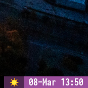

# Date blocklet

This is a blocklet, which displays current date with an icon depending on your current time. It uses [sunrise-sunset API](https://sunrise-sunset.org/api).



## Requirements

* C++ compiler supporting C++17 features.
* Noto Fonts Emoji.

## Installation

1. Run `make` to build the blocklet.

2. Copy `dateadv` file to your blocklets directory (`/usr/lib/i3blocks`, in my case).

```bash
sudo cp dateadv /usr/lib/i3blocks
```

3. Add `dateadv` configuration block to your `i3blocks.conf` file. Provide your latitude and longitude to get sunrise and sunset data. Blocklet saves API response to `/tmp/sunset_sunrise` file (you may change it in `dateadv.cpp`).

```
[dateadv]
interval=59
markup=pango
LAT=XX.XXXXXX
LNG=XX.XXXXXX
```

