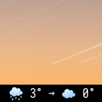

# Weather blocklet

This is a C++ version of my weather blocklet. It includes two implementations based on [nlohmann/json](https://github.com/nlohmann/json) and [rapidjson](https://github.com/Tencent/rapidjson) libraries. The first one is blocklet retrieves and shows current weather and forecast from OpenWeatherMap.



## Requirements

* G++ compiler

* API key for [OpenWeatherMap](https://openweathermap.org/api)

## Installation

1. Compile the blocklet using `make`:

```bash
make
```

2. Copy the compiled file to your blockets directory (`/usr/lib/i3blocks`, in my case):

```bash
sudo cp weather /usr/lib/i3blocks
```

3. Add `weather` configuration block to your `i3blocks.conf` file. Fill in `APIKEY` and `CITY` parameters:

```
[weather]
interval=1200
CITY=
APIKEY=
UNITS=metric
```

